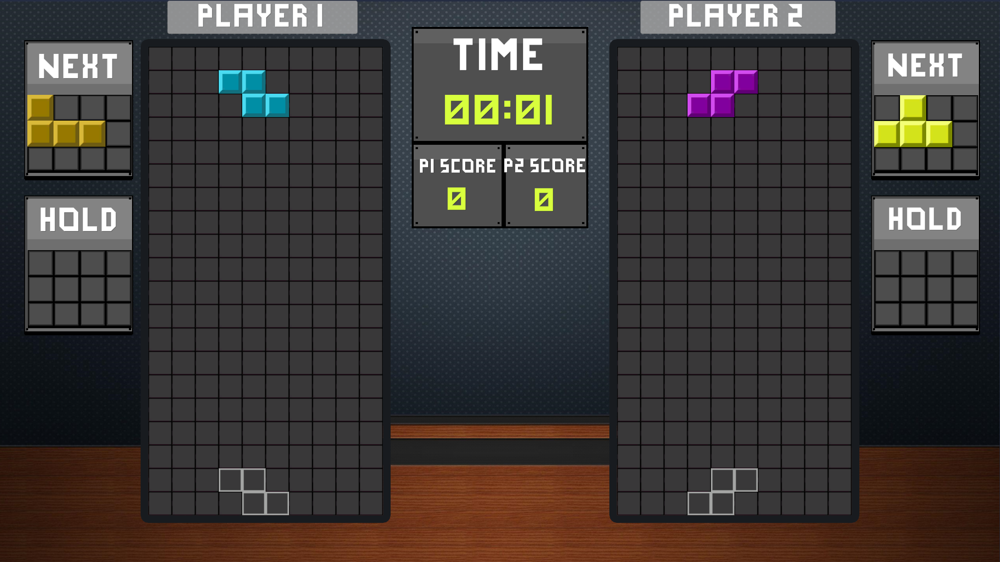
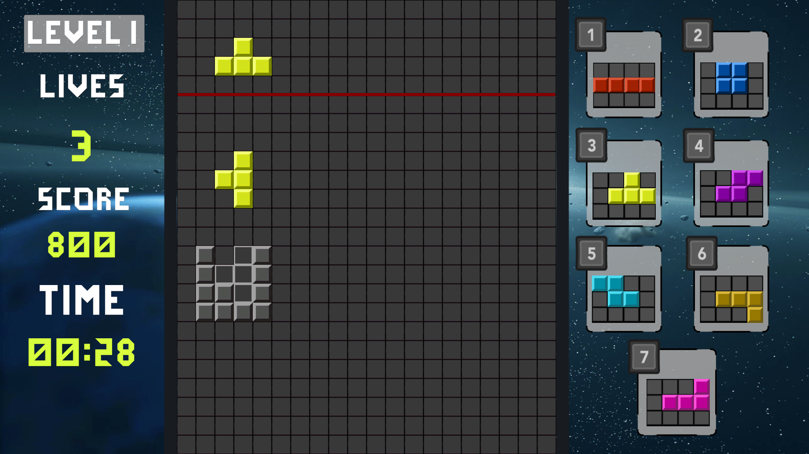

# Unity Tetris Game Project (Unity 俄罗斯方块项目)

## 📖 项目简介 (Introduction)

这是一个基于 **Unity** 引擎开发的俄罗斯方块（Tetris）游戏。本项目不仅完美复刻了经典的俄罗斯方块玩法，还创新性地加入了**双人对战**、**趣味模式**以及高难度的**挑战模式**。项目使用了 Unity 的 **New Input System** 进行输入管理，并采用了 **URP (Universal Render Pipeline)** 以获得更好的2D渲染效果。

## 🎮 游戏模式 (Game Modes)

本项目包含多种精心设计的游戏模式，满足不同玩家的需求：

### 1. 经典模式 (Classic Mode)

原汁原味的俄罗斯方块体验。

- **核心机制**：消除行数得分，随着等级提升下落速度加快。

- **辅助功能**：支持“幽灵方块”（Ghost Piece）预览落点，支持方块暂存（Hold）功能。

  

### 2. 双人对战模式 (2 Player Mode)

本地双人同屏竞技，体验互动的乐趣。

- **攻击机制**：当一名玩家一次性消除多行时，会向对手发送“垃圾行”（Attack Lines），增加对手的生存压力。
- **胜负判定**：坚持到最后的玩家获胜。
- 

### 3. 趣味模式 (Fun Mode)

打破常规的创意玩法。

- **特殊机制**：引入了 **Enemy Block (敌人方块)** 和 **Shooting (射击)** 机制。玩家可能需要消除特定的障碍物或应对干扰。
- **动态变化**：包含更多不可预测的随机元素。
- **

### 4. 不可能模式 (Impossible Mode) & 挑战模式 (Challenge Mode)

专为硬核玩家准备的极限挑战。

- **Board Spin**：部分高难度模式下，棋盘可能会发生**旋转**（基于 `BoardSpin.cs`），极大地干扰玩家的操作方向感。
- **自动生成行**：底部会通过 `AutoSpawnLine` 机制不断上涨，迫使玩家快速决策。

## ✨ 主要特性 (Key Features)

- **多样的方块控制**：流畅的移动、旋转、硬降（Hard Drop）和软降（Soft Drop）。
- **粒子与视觉特效**：消除行时的粒子效果、屏幕震动以及方块落地动画。
- **UI 系统**：使用 **SimplePixelUI** 和 **Quantum Tek Simple Menu** 构建的像素风用户界面，包含主菜单、设置、暂停界面等。
- **音效管理**：完整的背景音乐（BGM）和音效（SFX）管理系统。
- **设置系统**：支持调节音量大小及其他游戏参数。

## 🛠️ 技术栈 (Tech Stack)

- **Engine**: Unity 2021.3+ (推荐)
- **Render Pipeline**: Universal Render Pipeline (URP) 2D
- **Input**: Unity New Input System
- **UI**: UGUI, TextMesh Pro
- **Assets Used**:
  - Quantum Tek Simple Menu
  - SimplePixelUI

## ⌨️ 操作说明 (Controls)

*(请根据实际 Input Actions 配置进行微调)*

| **动作**            | **玩家 1 (键盘)** | **玩家 2 (键盘)**   |
| ------------------- | ----------------- | ------------------- |
| **移动**            | A / D             | Left / Right Arrows |
| **旋转**            | W                 | Up Arrow            |
| **软降 (加速)**     | S                 | Down Arrow          |
| **硬降 (直接落地)** | Space (空格)      | Enter / Numpad 0    |
| **暂存 (Hold)**     | Left Shift        | Right Shift / Ctrl  |
| **暂停**            | Esc               | -                   |

## 🚀 快速开始 (Getting Started)

1. 解压 Game.zip 运行其中的可执行文件

## 🤝 贡献与致谢 (Credits)

- 核心逻辑开发：xChang1021x
- UI 资源：SimplePixelUI
- 菜单系统：Quantum Tek Simple Menu

------

**Enjoy the game!**
